# Lab-01:SQL injection UNION attack, determining the number of columns returned by the query
> This lab contains an SQL injection vulnerability in the product category filter. The results from the query are returned in the application's response, so you can use a UNION attack to retrieve data from other tables. The first step of such an attack is to determine the number of columns that are being returned by the query. You will then use this technique in subsequent labs to construct the full attack.

> To solve the lab, determine the number of columns returned by the query by performing an [SQL injection UNION](https://portswigger.net/web-security/sql-injection/union-attacks/lab-determine-number-of-columns#:~:text=This%20lab%20contains,containing%20null%20values.) attack that returns an additional row containing null values.
### Cách giải
- lab này mình sẽ học về bước đầu tiên của một cuộc tấn công SQLi - xác định số lượng cột được trả về bởi truy vấn.
- Để giải quyết, ta cần tìm ra được số cột được trả về bởi truy vấn. 
- Vậy thì đầu tiên mình sẽ tìm cách để gửi truy vấn đi.
- Đây là giao diện đầu tiên của lab và không có chỗ nào cho mình điền truy vấn
> https://ace91f611f55b721c0ad04c900ff0016.web-security-academy.net/
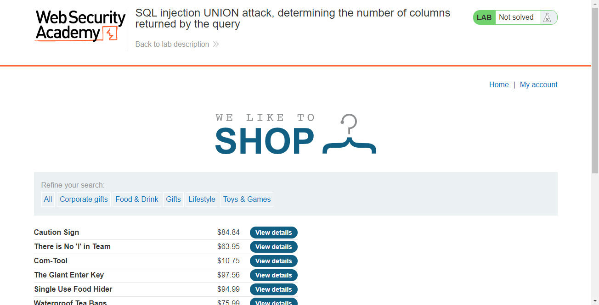
- Sau khi thử chọn một vài mục có sẵn thì mình vẫn không có form điền truy vần trên giao diện của lab nhưng url có thay đổi
> https://ace91f611f55b721c0ad04c900ff0016.web-security-academy.net/filter?category=Corporate+gifts
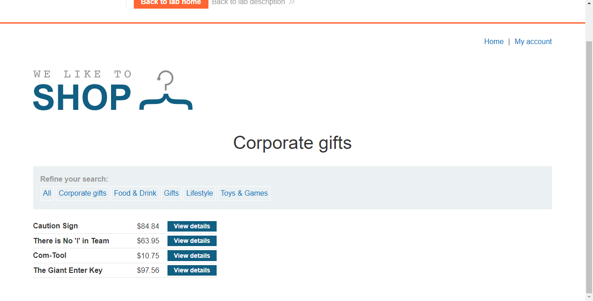
- Khi chọn các mục sản phẩm thì từ phía người dùng đã gửi lên server 1 request ```filter?category=Corporate+gifts```
=> input là Corporate+gifts
- Tiếp theo mình dùng 1 thủ thuật để thử kiểm tra xem có lỗi SQLi khi mình truy vấn hay không bằng cách điền các kí tự đặc biệt như '" ; , - -- .....
- Mình sẽ thử với một dấu nháy đơn '
> Như vậy là đã có lỗi xảy ra với truy vấn
https://ace91f611f55b721c0ad04c900ff0016.web-security-academy.net/filter?category='
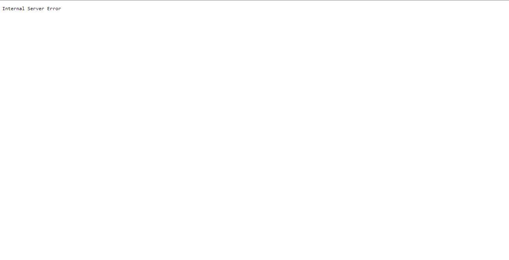

- Tiếp theo mình sẽ thử truy vấn 1 cột nhưng vẫn lỗi tức là truy vấn sai
```
' UNION SELECT null--
```
> 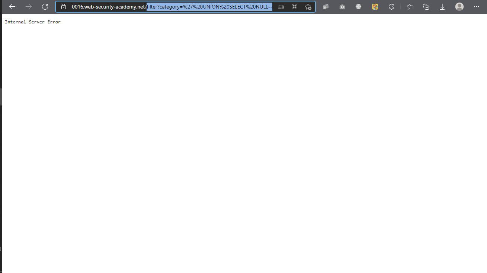
- Mình tiếp tục thử với số lượng lớn hơn: 4 cột và vẫn lỗi như vậy.
```
' UNION SELECT null, null, null, null--
```
- Thử tiếp với 3 cột và thành công.
```
' UNION SELECT null,  null, null--
```
> 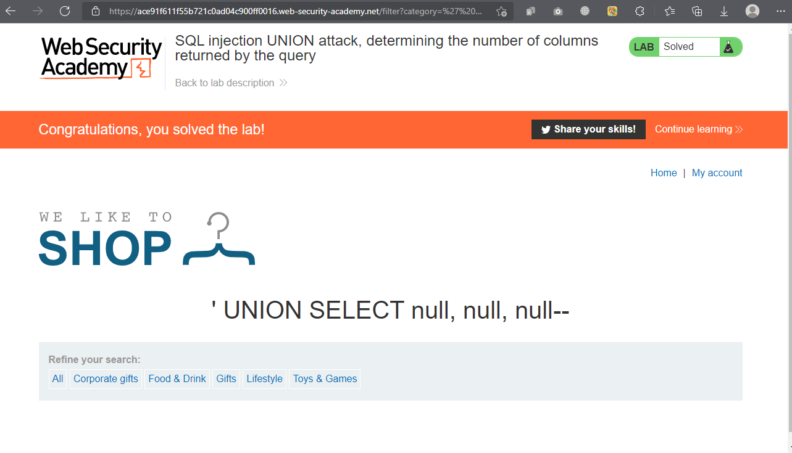
- Như vậy chúng ta đã hoàn thành bài lab, kết quả cuối cùng cho ta biết số cột được trả về bởi truy vấn là 3 cột.
# Lab-02: SQL injection UNION attack, finding a column containing text
> This lab contains an SQL injection vulnerability in the product category filter. The results from the query are returned in the application's response, so you can use a UNION attack to retrieve data from other tables. To construct such an attack, you first need to determine the number of columns returned by the query. You can do this using a technique you learned in a previous lab. The next step is to identify a column that is compatible with string data.

> The lab will provide a random value that you need to make appear within the query results. To solve the lab, perform an SQL injection UNION attack that returns an additional row containing the value provided. This technique helps you determine which columns are compatible with string data.
### Cách giải: 
- Ở lab này nhiệm vụ của mình là làm cho cơ sở dữ liệu truy xuất chuỗi: 'BYqm05'
> 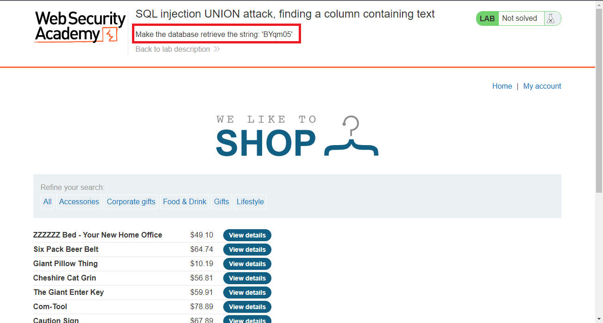
- Tương tự như bài trước đầu tiên mình đã kiểm tra và truy vấn trả về 3 cột:
> ' UNION SELECT null, null, null--
- Giờ để tìm chuỗi được yêu cầu mình sẽ thay null bằng chuỗi đó.
- Thử với cột đầu tiên:
```
' UNION SELECT 'BYqm05', null, null--
```
- Truy vấn này sẽ trả về chuỗi cần tìm nếu như loại dữ liệu của cột tương thích với dữ liệu chuỗi nếu không sẽ lỗi:
> 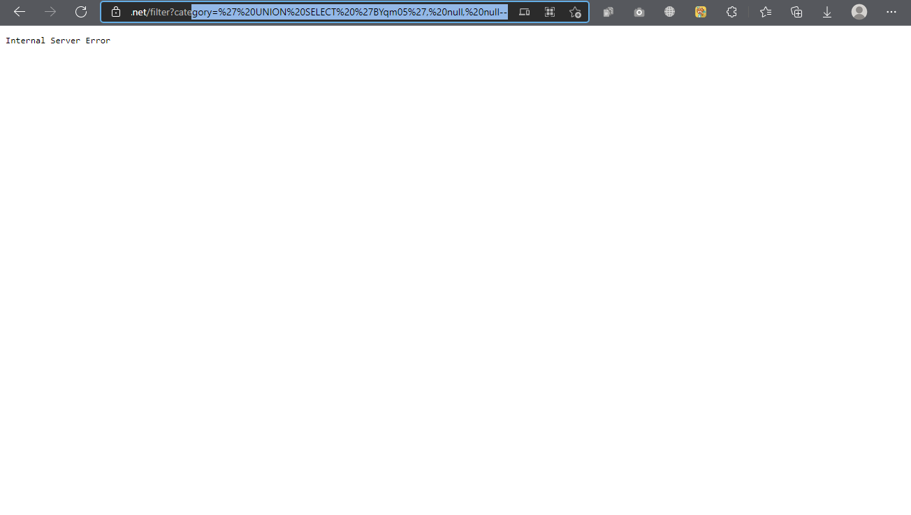
- Cứ thế mình sẽ thử với các cột tiếp theo và hoàn thành lab ở cột thứ 2:
> 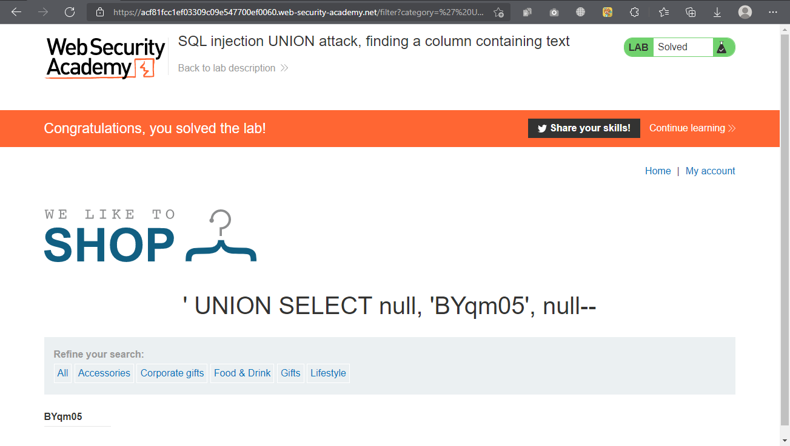

# Lab-03: SQL injection UNION attack, retrieving data from other tables
> This lab contains an SQL injection vulnerability in the product category filter. The results from the query are returned in the application's response, so you can use a UNION attack to retrieve data from other tables. To construct such an attack, you need to combine some of the techniques you learned in previous labs.
> The database contains a different table called users, with columns called username and password.
> To solve the lab, perform an SQL injection UNION attack that retrieves all usernames and passwords, and use the information to log in as the administrator user
### Cách giải:
- Tiếp nối 2 lab trước, thay vì chỉ truy vấn được 1 giá trị thì ở lab này mình sẽ phải truy vấn thông tin từ database.
- Đề bài đã cho ta biết tên table là user và với 2 cột username và password. Việc của mình cần làm là lấy giữ liệu từ 2 cột này.
- Để làm được điều này đầu tiên mình sử dụng các kĩ thuật UNION attack như ở Lab-01 và Lab-02 và sau đó mình sẽ inject một câu truy vấn để Server trả về tất cả các username và password của TABLE users.
- Bước 1: Kiểm tra số cột, mình đã tìm được 2 cột:
> 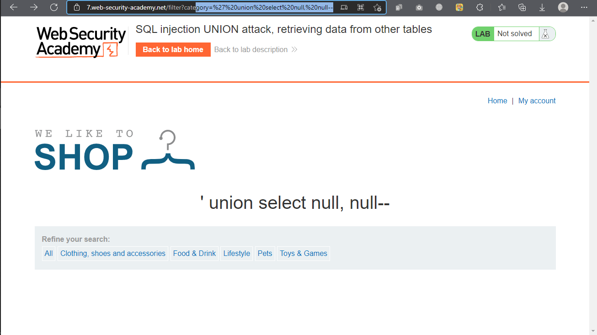
- Bước 2: Kiểm tra dữ liệu các cột, cả 2 cột đều trả về giá trị => cả 2 cột đều có dữ liệu:
> 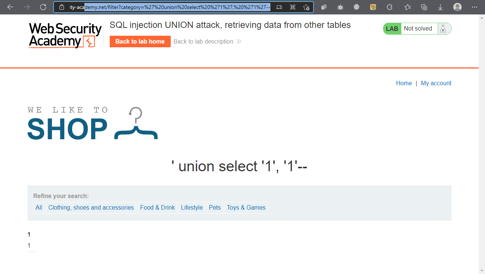
- Bước 3: Mình sẽ inject 1 câu truy vấn để lấy dữ liệu ```username``` và ```password``` từ table ```users``` 
```
' UNION SELECT username, password FROM users--
```
> 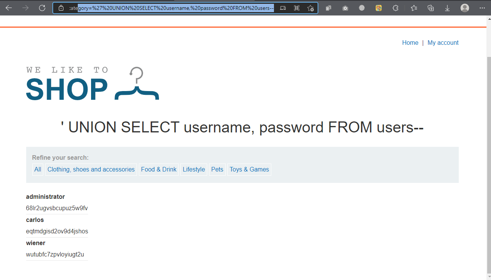
- Cuối cùng mình lấy username và password tìm được để đăng nhập là hoàn thành lab.
# Lab-04: SQL injection UNION attack, retrieving multiple values in a single column.
> This lab contains an SQL injection vulnerability in the product category filter. The results from the query are returned in the application's response so you can use a UNION attack to retrieve data from other tables.
> The database contains a different table called users, with columns called username and password.
> To solve the lab, perform an SQL injection UNION attack that retrieves all usernames and passwords, and use the information to log in as the administrator user
### Cách giải:
- Đầu tiên mình làm tương tự như những lab trươc:
- Bước 1 + 2: Kiểm tra số cột và kiểm tra dữ liệu cột, mình đã tìm được 2 cột và chỉ có cột thứ 2 trả về dữ liệu:
``` ' UNION SELECT null, 'a'-- ```
> 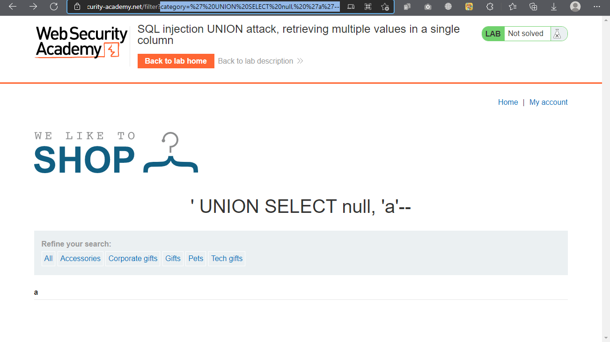
- Ở đây mình cần truy vấn 2 trường kết quả nhưng chỉ có một cột truy vấn được.Tới đây mình quay lại xem hint từ đề bài:
> You can find some useful payloads on our [SQL injection cheat sheet](https://portswigger.net/web-security/sql-injection/cheat-sheet).
- Ban đầu mình thử truy vấn thì kết quả chỉ có username:
``` ' UNION SELECT null, username FROM users--```
> 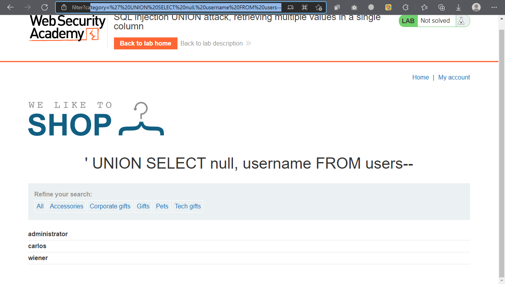
- Sau khi xem hint mình đã thử cách nối chuỗi trong  SQL injection cheat sheet và kết quả là lấy được cả pass và username.
``` ' UNION SELECT null, username || password FROM users--```
> 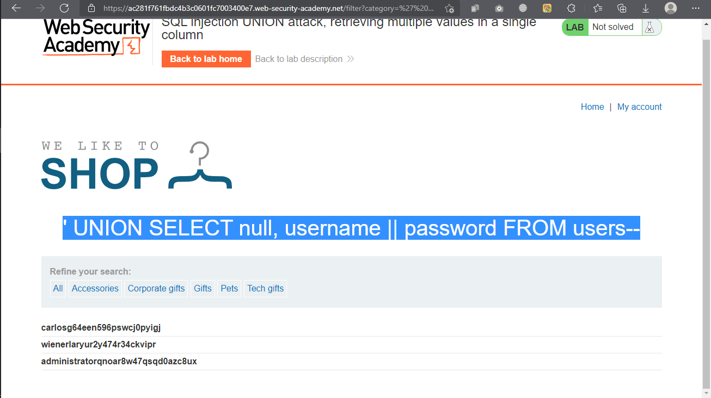
- Sửa lại câu truy vấn cho dễ nhìn bằng cách thêm ký tự giữa username và password sau đó lấy accout đăng nhập là hoàn thành lab.
``` ' UNION SELECT null, username || '------ ' ||password FROM users--```
> 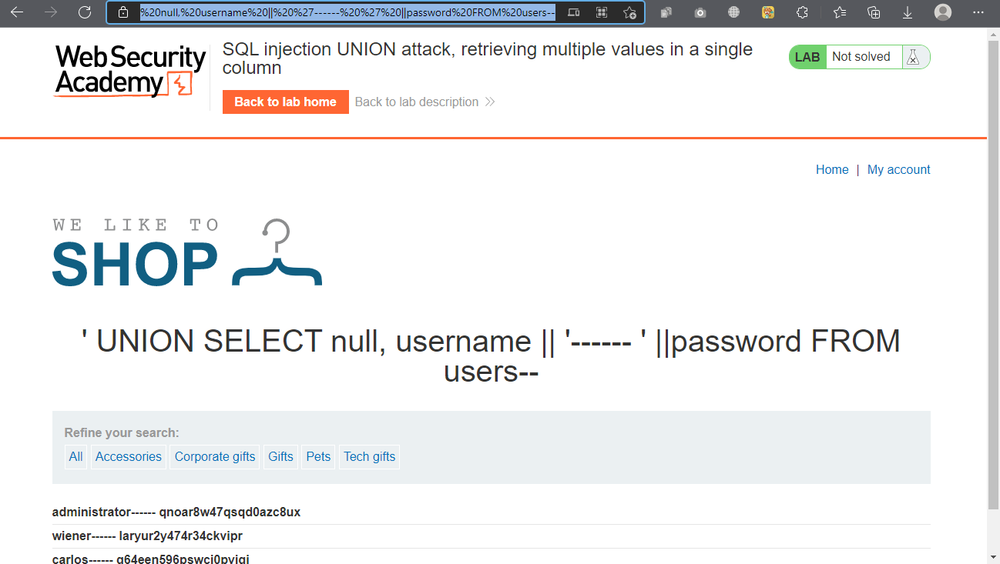

# Lab-05: SQL injection attack, querying the database type and version on Oracle
> This lab contains an SQL injection vulnerability in the product category filter. You can use a UNION attack to retrieve the results from an injected query.
>To solve the lab, display the database version string
### Cách giải:
- In ra version đầy đủ của database là việc mình cần làm để giải quyết lab này:
```To solve the lab, display the database version string.```
> 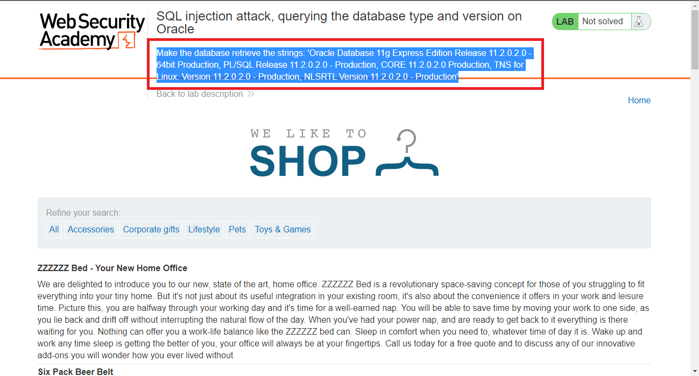
- Hint từ đề:
> On Oracle databases, every SELECT statement must specify a table to select FROM. If your UNION SELECT attack does not query from a table, you will still need to include the FROM keyword followed by a valid table name.
> There is a built-in table on Oracle called dual which you can use for this purpose. For example: UNION SELECT 'abc' FROM dual
> For more information, see our [SQL injection cheat sheet](https://portswigger.net/web-security/sql-injection/cheat-sheet).
- Dịch ra mình có thể hiểu là:
>  Mọi truy vấn đều phải có FROM từ một table nào đó.
> Có một bảng tích hợp trên Oracle được gọi là ```dual``` mà bạn có thể sử dụng cho mục đích này.
- Cụ thể như sau:
> Nếu mình chỉ truy vấn với câu lệnh như bình thường giống như các DBSM khác thì Oracle sẽ trả về lỗi:  
                   
```'UNION SELECT null, null --```
> 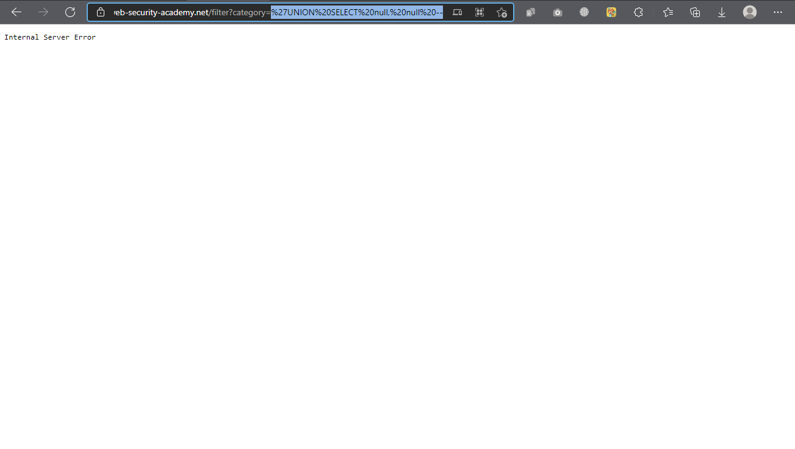

- Với Oracle bắt buộc phải có ``` FROM 'table' ```  và 'table' có thể thay bằng 'DUAL' - một bảng tự động được tạo bởi Cơ sở dữ liệu Oracle cùng với từ điển dữ liệu.

```'UNION SELECT null, null FROM DUAL--```

> 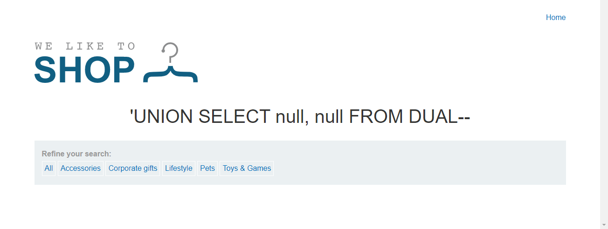

- Từ đó mình có thể truy vấn được version của database on Oracle 
> 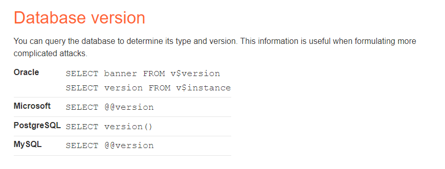
- Hoàn thành lab
```' UNION SELECT null, banner FROM v$version--```
> 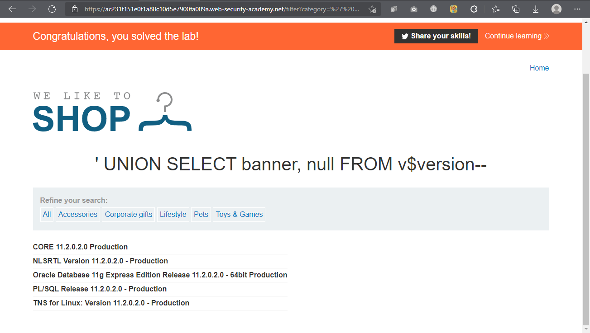
# Lab-06: SQL injection attack, querying the database type and version on MySQL and Microsoft.
> This lab contains an SQL injection vulnerability in the product category filter. You can use a UNION attack to retrieve the results from an injected query.
> To solve the lab, display the database version string.
- Cách giải:
- Tương tự như bài trước, ở lab này mình sẽ phải lấy database version của MySQL và Microsoft.
- Vì vậy truy vấn sẽ khác với Oracle.
- Trong MySQL Comment là: ```-- comment``` tức là sau ```--``` phải có 1 khoảng trắng.
Mà nếu để khoảng trắng ở cuối trên url thì nó sẽ bị bỏ mất nên sau dấu cách đó mình phải thêm 1 ký tự gì cũng được.
- Đầu tiên mình sẽ xác định số cột:
```' UNION SELECT null, null-- a```

> 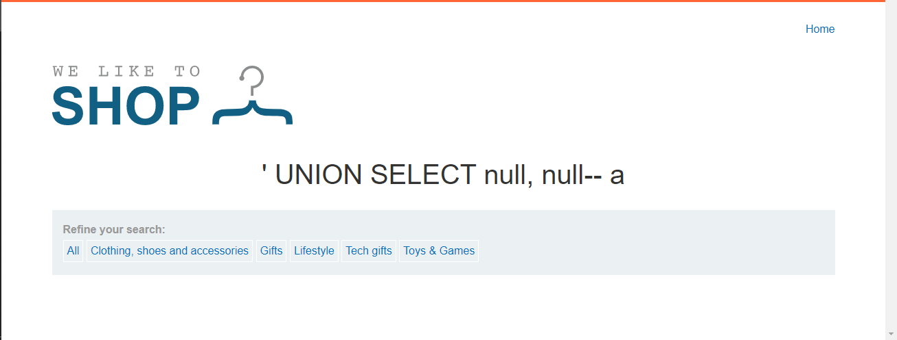
- Sau đó đựa vào Database version trong [SQL injection cheat sheet](https://portswigger.net/web-security/sql-injection/cheat-sheet) => thay null thành @@version để lấy database version là hoàn thành bài lab.
```' UNION SELECT @@version, null-- a```

> 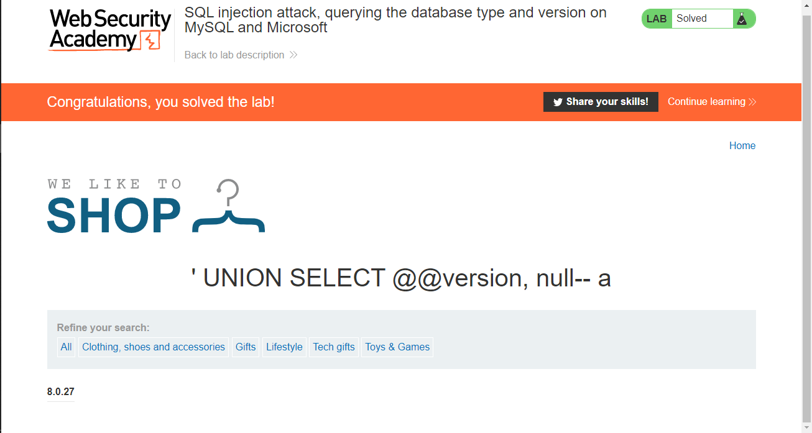

# Lab-07: SQL injection attack, listing the database contents on non-Oracle databases
> This lab contains an SQL injection vulnerability in the product category filter. The results from the query are returned in the application's response so you can use a UNION attack to retrieve data from other tables.
> The application has a login function, and the database contains a table that holds usernames and passwords. You need to determine the name of this table and the columns it contains, then retrieve the contents of the table to obtain the username and password of all users.
> To solve the lab, log in as the administrator user.
### Cách giải:
- Đầu tiên kiểm tra số cột => 2 cột 
```
' UNION SELECT null, null--
```
- Tiếp theo mình phải đi tìm tên của table.
- Trong sql database luôn có 1 bảng là INFORMATION_SCHEMA ( trừ oracle ) chứa các thông tin của cơ sở dữ liệu
- Dựa vào đó mình tìm ra các bảng trong database:
``` ' UNION SELECT TABLE_NAME, NULL FROM INFORMATION_SCHEMA.TABLES-- -```
> 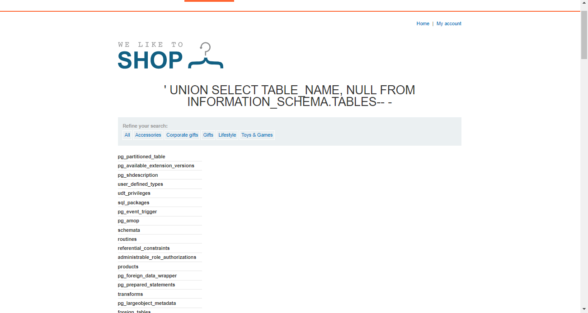

- Sau khi đọc tài liệu về [Schemas](https://www.postgresql.org/docs/8.1/ddl-schemas.html#DDL-SCHEMAS-PUBLIC) ở phần 5.7.2. The Public Schema thì mình đã thử truy vấn table "public"
> 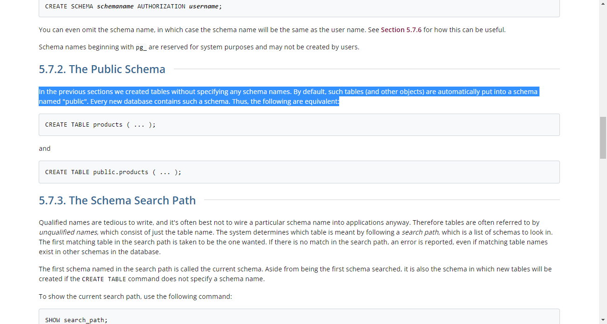

```'UNION SELECT null, table_name FROM information_schema.tables WHERE table_schema='public'--```
> 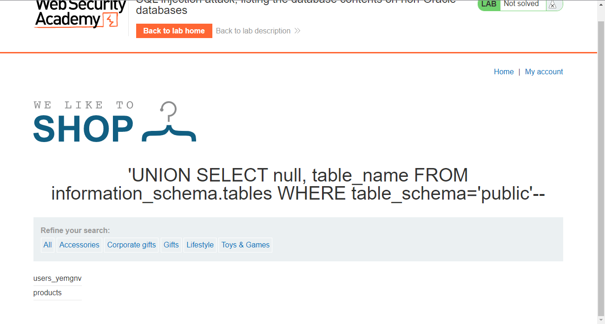
- Tìm được 2 table khác và thứ mình cần là username và password nên mình tiếp túc tìm cột với bảng ```users_yemgnv```:
``` 'UNION SELECT null, column_name FROM information_schema.columns WHERE table_name='users_yemgnv'--```
> 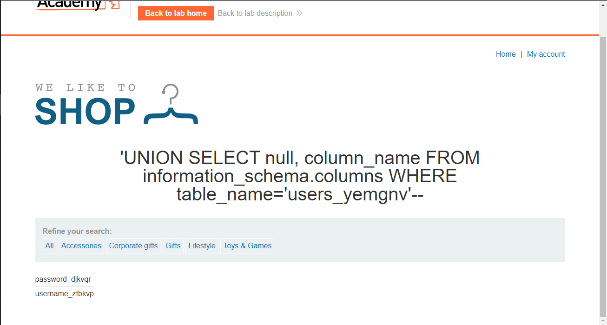
- Tiếp túc với 2 cột này và tìm được account:
``` 'UNION SELECT password_djkvqr, username_ztbkvp FROM users_yemgnv--```
> 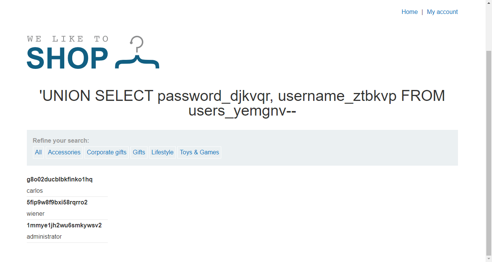
- Đăng nhập để hoàn thành lab.
# Lab-08: SQL injection attack, listing the database contents on Oracle
> This lab contains an SQL injection vulnerability in the product category filter. The results from the query are returned in the application's response so you can use a UNION attack to retrieve data from other tables.
The application has a login function, and the database contains a table that holds usernames and passwords. You need to determine the name of this table and the columns it contains, then retrieve the contents of the table to obtain the username and password of all users.
To solve the lab, log in as the administrator user.
### Cách giải:
- Đề bài lab này tương tự lab-07, tuy nhiên database lại là Oracle.
- Kết hợp với kiến thức từ những lab trước khi làm việc với Oracle và gợi ý từ [SQL injection cheat sheet](https://portswigger.net/web-security/sql-injection/cheat-sheet)
> 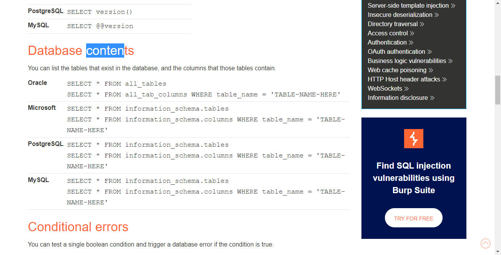
- Sau khi xác định được số cột:
``` ' UNION SELECT null, null from dual--```
> 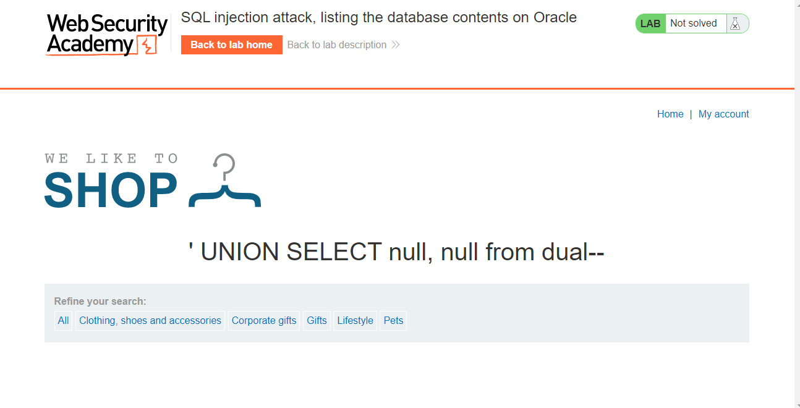
- Mình thử truy vấn all table thì có rất nhiều bảng hiện ra:
``` ' UNION SELECT TABLE_NAME, NULL FROM ALL_TABLES--```
> 
> 
- Mình nghĩ table chứa account tên có thể giống như lab-07 nên đã thử tìm và ra được table ```USERS_XVKMBK```
- Tiếp tục
``` ' UNION SELECT COLUMN_NAME, null FROM all_tab_columns WHERE table_name = 'USERS_XVKMBK'-- ```
> 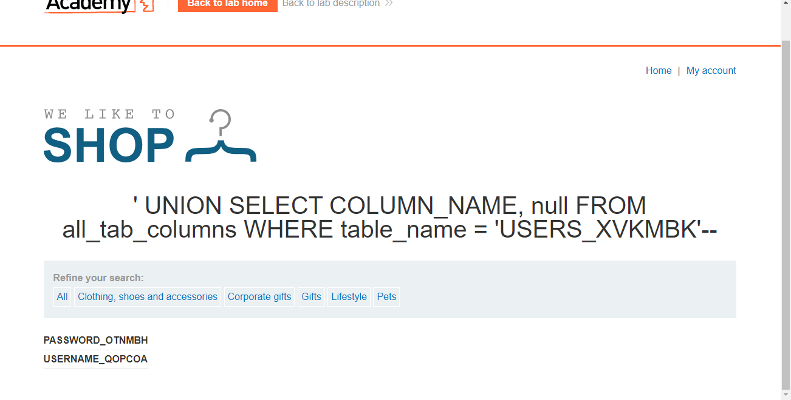

```
' UNION SELECT PASSWORD_OTNMBH, USERNAME_QOPCOA FROM USERS_XVKMBK--
```
> 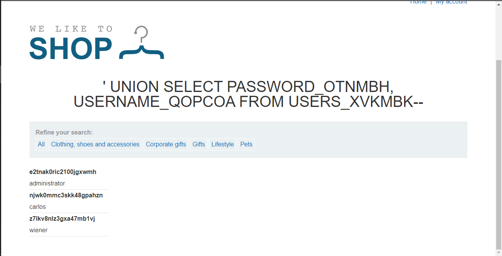
- Đăng nhập để hoàn thành lab.
# Lab-09: Lab: SQL injection vulnerability in WHERE clause allowing retrieval of hidden data
> This lab contains an SQL injection vulnerability in the product category filter. When the user selects a category, the application carries out an SQL query like the following:
SELECT * FROM products WHERE category = 'Gifts' AND released = 1
To solve the lab, perform an SQL injection attack that causes the application to display details of all products in any category, both released and unreleased.
### Cách giải:
- Bài lab này yêu cầu hiển thị tất cả các sản phẩm trong bảng product.
- Và đề cũng cho mình luôn 1 câu truy vấn:
```SELECT * FROM products WHERE category = 'Gifts' AND released = 1```
- Và ở bài này mình sử dụng ```' OR 1=1--```
``` SELECT * FROM products WHERE category = ' OR 1=1--' AND released = 1```
> 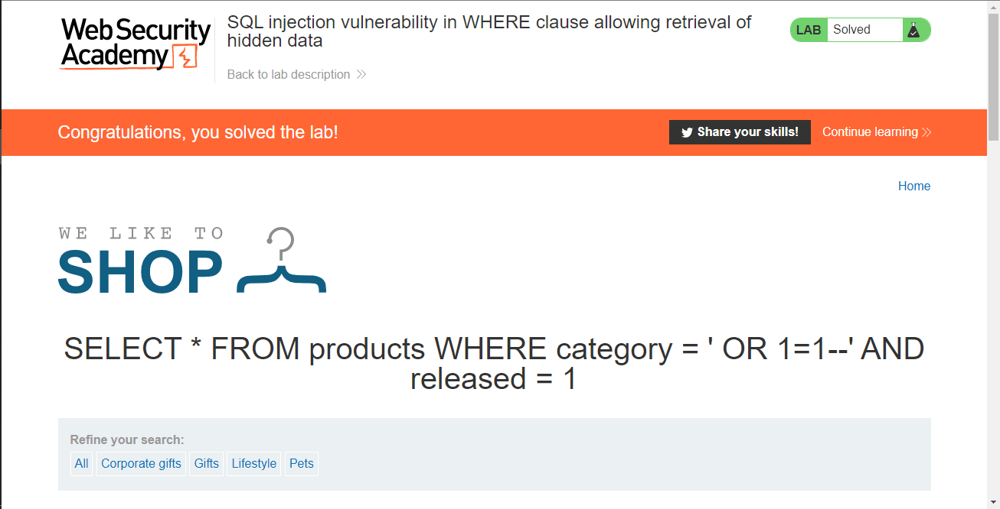
- Ngắn gọn hơn:``` ' OR 1=1--```
> 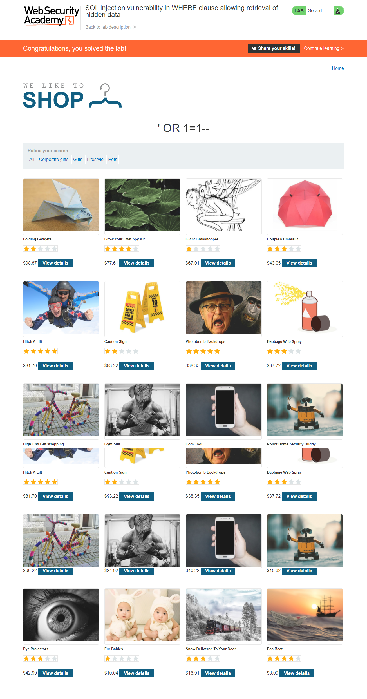
# Lab-10: SQL injection vulnerability allowing login bypass
> This lab contains an SQL injection vulnerability in the login function.
To solve the lab, perform an SQL injection attack that logs in to the application as the administrator user.
### Cách giải:
- Để giải quyết lab này mình cần phải login với tư cách là người dùng administrator.
- Đầu tiên mình vào phần đăng nhập và thử username và pass bất kỳ thì không được.
- Tiếp theo mình thử đăng nhập bằng ```username: ' or 1 = 1 --``` và pass bất kỳ hoặc username bất kỳ và ```password: ' or 1 = 1 --``` thì lab được giải quyết 


 


